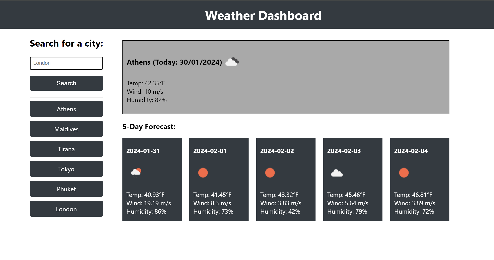

# Weather-Dashboard

## Description
This project is a weather dashboard application that provides weather data for cities. It uses the OpenWeather API to retrieve weather data and localStorage to store persistent data. The application allows users to search for a city and get current and future weather conditions. The searched city is also added to the search history.

## User Story
As a traveler, I want to see the weather outlook for multiple cities so that I can plan a trip accordingly.

## Features
Search for a city and get current and future weather conditions.
View current weather conditions including city name, date, weather icon, temperature, humidity, and wind speed.
View future weather conditions for a city over a 5-day period, displaying date, weather icon, temperature, and humidity.
Click on a city in the search history to view its current and future weather conditions.

## Usage
To use this application, follow these steps:

- Enter the name of a city in the search bar.
- Press the "Search" button to get the current and future weather conditions for that city.
- The city name will be added to the search history. Click on a city in the search history to view its weather conditions again.

Here is a screenshot of the weather dashboard webpage:

You can visit the website by clicking on this [LINK](https://cntervisi.github.io/Weather-Dashboard/).

## License
This project is licensed under the MIT License. See the [license](./LICENSE) file for more details.
